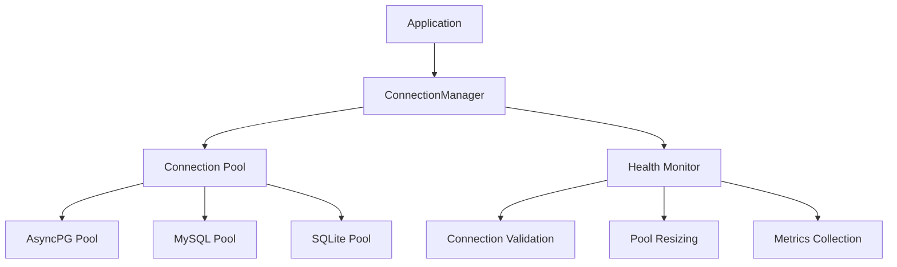

# Andamios ORM Architecture

## Overview

Andamios ORM is designed as a high-performance, async-first ORM built on SQLAlchemy 2.0+ with uvloop for optimal performance. The architecture follows clean separation of concerns, enabling testability, maintainability, and extensibility.

## Core Architecture Layers

### 1. Connection & Engine Layer (`core/`)

```python
# core/engine.py
class AndamiosEngine:
    """High-performance async database engine with uvloop optimization"""
    
# core/connection.py  
class ConnectionManager:
    """Manages connection pooling and lifecycle"""
    
# core/session.py
class AsyncSession:
    """Session management with transaction support"""
```

**Responsibilities:**
- Database connection management
- Connection pooling optimization
- Transaction handling
- uvloop integration for performance
- Connection health monitoring

### 2. Model Layer (`models/`)

```python
# models/base.py
class BaseModel:
    """Base model with common functionality"""
    
class TimestampedModel(BaseModel):
    """Model with created_at/updated_at timestamps"""
    
class SoftDeleteModel(TimestampedModel):
    """Model with soft delete capability"""

# models/mixins.py
class AuditMixin:
    """Audit trail functionality"""
    
class VersioningMixin:
    """Optimistic locking support"""
```

**Responsibilities:**
- Base model definitions
- Common model mixins
- Field definitions and validations
- Relationship configurations
- Model lifecycle hooks

### 3. Repository Layer (`repositories/`)

```python
# repositories/base.py
class BaseRepository[T]:
    """Base repository with CRUD operations"""
    
# repositories/generic.py  
class GenericRepository[T](BaseRepository[T]):
    """Generic repository with advanced querying"""
    
# repositories/specialized.py
class ReadOnlyRepository[T](BaseRepository[T]):
    """Read-only repository for immutable data"""
```

**Responsibilities:**
- Data access abstraction
- CRUD operations
- Complex query building
- Transaction management
- Caching strategies

### 4. Query Layer (`queries/`)

```python
# queries/builder.py
class QueryBuilder[T]:
    """Fluent query building interface"""
    
# queries/filters.py
class FilterBuilder:
    """Dynamic filter construction"""
```

**Responsibilities:**
- Query construction
- Filter building
- Join management
- Aggregation support
- Query optimization

## Async Architecture Design

### Event Loop Integration

```python
import uvloop
import asyncio

# Automatic uvloop setup
if not asyncio._get_running_loop():
    uvloop.install()
```

### Connection Pool Architecture



### Session Management

```python
class SessionManager:
    async def __aenter__(self) -> AsyncSession:
        """Context manager entry"""
        
    async def __aexit__(self, exc_type, exc_val, exc_tb):
        """Automatic cleanup and transaction handling"""
```

## Repository Pattern Implementation

### Base Repository Design

```python
from typing import TypeVar, Generic, Optional, List
from abc import ABC, abstractmethod

T = TypeVar('T', bound=BaseModel)

class IRepository[T](ABC, Generic[T]):
    """Repository interface for dependency injection"""
    
    @abstractmethod
    async def get_by_id(self, id: Any) -> Optional[T]: ...
    
    @abstractmethod  
    async def create(self, entity: T) -> T: ...
    
    @abstractmethod
    async def update(self, entity: T) -> T: ...
    
    @abstractmethod
    async def delete(self, id: Any) -> bool: ...
    
    @abstractmethod
    async def list(self, filters: Optional[dict] = None) -> List[T]: ...
```

### Specialized Repositories

```python
class UserRepository(GenericRepository[User]):
    """User-specific repository with custom methods"""
    
    async def find_by_email(self, email: str) -> Optional[User]:
        """Find user by email address"""
        
    async def get_active_users(self) -> List[User]:
        """Get all active users"""
        
    async def update_last_login(self, user_id: int) -> None:
        """Update user's last login timestamp"""
```

## Query Builder Architecture

### Fluent Interface Design

```python
# Example usage
users = await (
    QueryBuilder(User)
    .filter(User.age >= 18)
    .filter(User.is_active == True)
    .join(User.profile)
    .order_by(User.created_at.desc())
    .limit(10)
    .execute()
)
```

### Filter System

```python
class FilterBuilder:
    def __init__(self, model: Type[BaseModel]):
        self.model = model
        self.conditions = []
    
    def eq(self, field: str, value: Any) -> 'FilterBuilder':
        """Equal comparison"""
        
    def in_(self, field: str, values: List[Any]) -> 'FilterBuilder':
        """IN clause"""
        
    def between(self, field: str, start: Any, end: Any) -> 'FilterBuilder':
        """BETWEEN clause"""
```

## Testing Architecture

### Database Test Management

```python
class TestDatabaseManager:
    """Manages isolated test databases for parallel testing"""
    
    async def create_test_database(self, worker_id: str) -> str:
        """Create isolated database for test worker"""
        
    async def cleanup_test_database(self, worker_id: str) -> None:
        """Clean up test database after tests"""
```

### Test Fixtures

```python
@pytest.fixture
async def db_session(test_database):
    """Provide clean database session for tests"""
    async with AsyncSession(test_database) as session:
        yield session
        await session.rollback()

@pytest.fixture  
async def user_repository(db_session):
    """Provide user repository for tests"""
    return UserRepository(db_session)
```

## Performance Optimizations

### Connection Pool Tuning

```python
ENGINE_CONFIG = {
    'pool_size': 20,
    'max_overflow': 30,
    'pool_pre_ping': True,
    'pool_recycle': 3600,
    'echo': False,  # Disable in production
}
```

### Query Optimization

```python
class QueryOptimizer:
    """Automatic query optimization"""
    
    def analyze_query(self, query: Query) -> QueryPlan:
        """Analyze query execution plan"""
        
    def suggest_indexes(self, query: Query) -> List[str]:
        """Suggest database indexes"""
```

### Caching Strategy

```python
class CacheManager:
    """Multi-level caching system"""
    
    async def get_cached_result(self, key: str) -> Optional[Any]:
        """Get from L1 (memory) or L2 (Redis) cache"""
        
    async def set_cached_result(self, key: str, value: Any, ttl: int):
        """Set in both cache levels"""
```

## Migration Architecture

### Migration Manager

```python
class MigrationManager:
    """Enhanced Alembic integration"""
    
    async def apply_migrations(self) -> None:
        """Apply pending migrations"""
        
    async def generate_migration(self, message: str) -> str:
        """Generate new migration file"""
        
    async def rollback_migration(self, revision: str) -> None:
        """Rollback to specific revision"""
```

### Schema Versioning

```python
class SchemaVersion:
    """Track schema versions across environments"""
    
    async def get_current_version(self) -> str:
        """Get current schema version"""
        
    async def validate_compatibility(self, target_version: str) -> bool:
        """Check version compatibility"""
```

## Error Handling & Resilience

### Connection Resilience

```python
class ConnectionResilience:
    """Handle connection failures gracefully"""
    
    @retry(stop=stop_after_attempt(3), wait=wait_exponential(multiplier=1, min=4, max=10))
    async def execute_with_retry(self, operation: Callable) -> Any:
        """Execute operation with retry logic"""
```

### Transaction Management

```python
class TransactionManager:
    """Advanced transaction handling"""
    
    async def execute_in_transaction(self, operations: List[Callable]) -> None:
        """Execute multiple operations in single transaction"""
        
    async def savepoint(self, name: str) -> SavepointContext:
        """Create savepoint for nested transactions"""
```

## Monitoring & Observability

### Metrics Collection

```python
class MetricsCollector:
    """Collect ORM performance metrics"""
    
    async def track_query_performance(self, query: str, duration: float) -> None:
        """Track query execution time"""
        
    async def track_connection_usage(self, pool_stats: dict) -> None:
        """Track connection pool statistics"""
```

### Health Checks

```python
class HealthChecker:
    """Database and connection health monitoring"""
    
    async def check_database_connectivity(self) -> HealthStatus:
        """Check if database is accessible"""
        
    async def check_pool_health(self) -> PoolHealth:
        """Monitor connection pool health"""
```

## Integration Points

### FastAPI Integration

```python
class FastAPIIntegration:
    """FastAPI dependency injection setup"""
    
    def create_repository_dependencies(self) -> dict:
        """Create repository dependencies for FastAPI"""
        
    async def lifespan_handler(self, app: FastAPI):
        """Handle application startup/shutdown"""
```

### Pydantic Integration

```python
class PydanticModelAdapter:
    """Convert between ORM models and Pydantic models"""
    
    def to_pydantic(self, orm_model: BaseModel) -> BaseModel:
        """Convert ORM model to Pydantic model"""
        
    def from_pydantic(self, pydantic_model: BaseModel) -> BaseModel:
        """Create ORM model from Pydantic model"""
```

## Security Considerations

### SQL Injection Prevention

- All queries use parameterized statements
- Input validation at repository layer
- Query builder prevents direct SQL injection

### Connection Security

- Encrypted connections by default
- Connection string encryption at rest
- Secure credential management

### Audit Logging

```python
class AuditLogger:
    """Security audit logging"""
    
    async def log_data_access(self, user_id: str, table: str, operation: str) -> None:
        """Log data access for security audit"""
```

This architecture provides a solid foundation for building a high-performance, scalable, and maintainable ORM library that meets all the specified requirements.